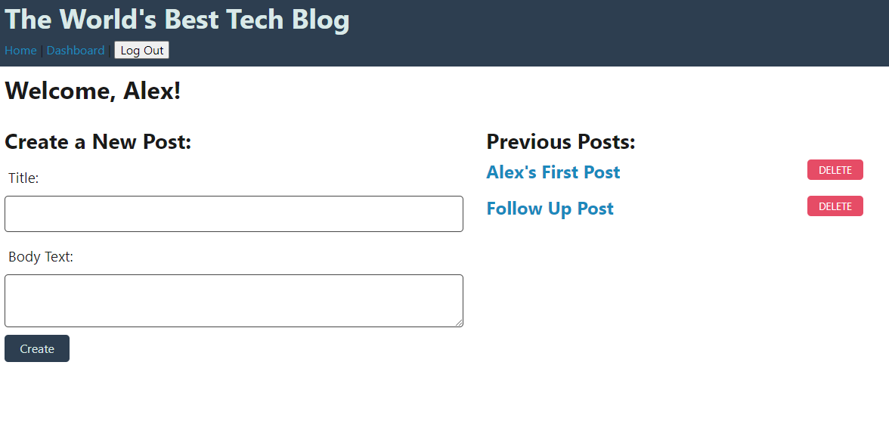

# Tech Blog
## Description
The application allows user to write blog posts discussing the programming and related topics. Users are able to login and logout to this content management system (CMS)-style website. In addition to posting, user can leave comments that are associated with their username. With this site, you can now share your thoughts and opinions with an audience on the internet.
## Instructions
Begin by logging in with your username and password. If you do not have an account, you can create one. Once logged in, you are able to write a new blog post, see previous posts, and provides comments on existing posts. All sessions time out after one hour.

[GitHub Repository](https://github.com/matthale11/tech-blog)

